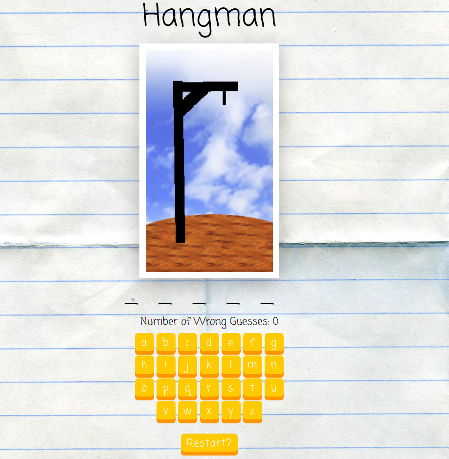
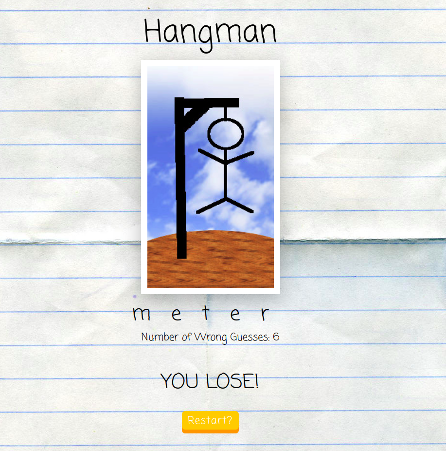
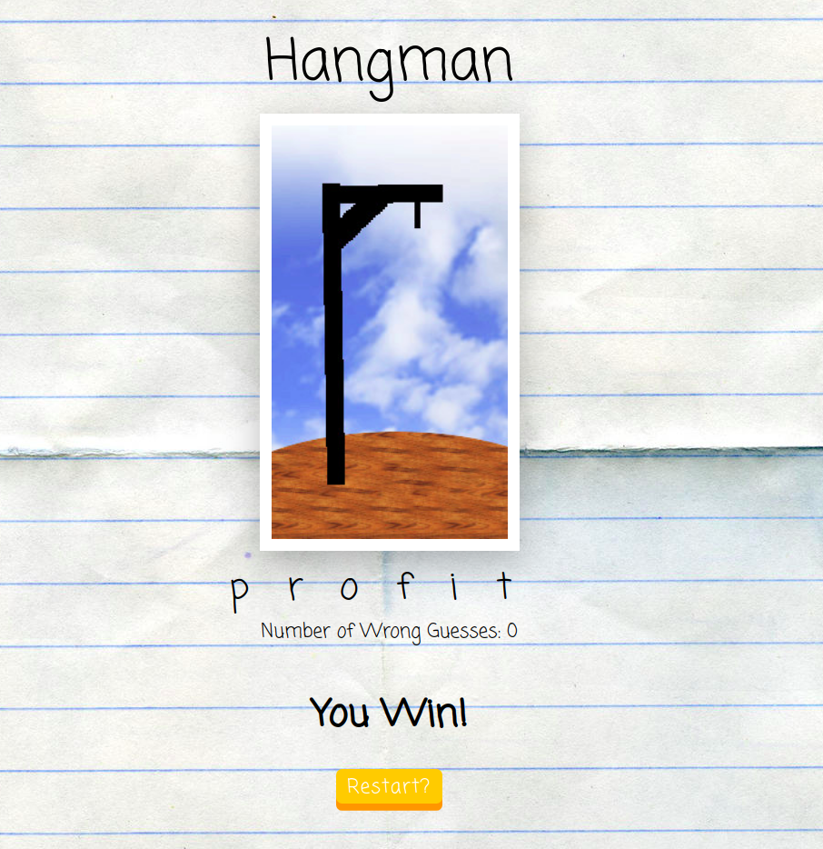

## Hangman Game

#### Hangman Component

- Props

  - **maxWrong**
  - **images:** arrays of images; Hangman image change after every wrong guess

- State
  - **nWrong:** a number of wrong guesses
  - **guessed** a Set that contains letters that were guessed
  - **answer:** a word, randomly choosen by _randomWord_ function from array
- Events
  - **onClick**
    - **handleGuess:** handle a guessed letter, add to _guessed_ array, if this letter isn`t in the answer, increase _nWrong_ guesses
    - **reset:** choose new answer from array, create new Set _guessed_, set nWrong:0

  
  

